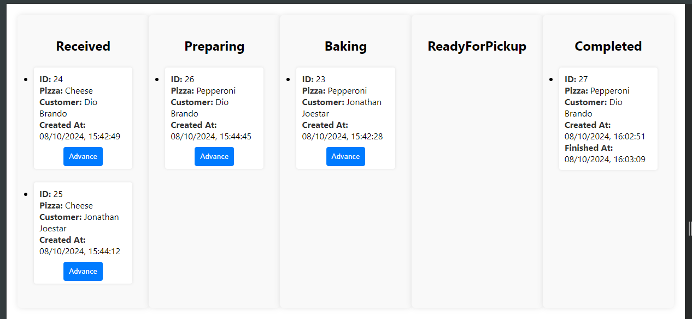
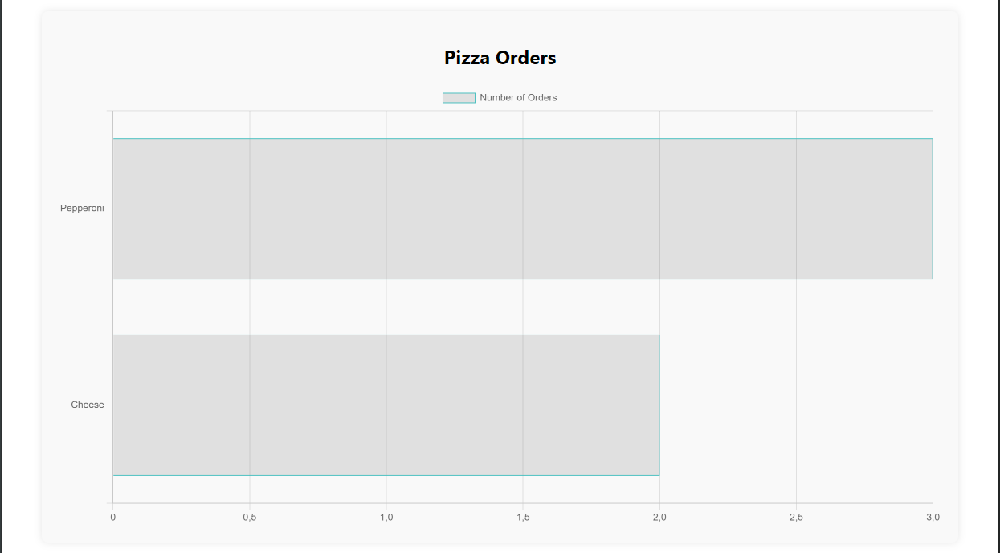
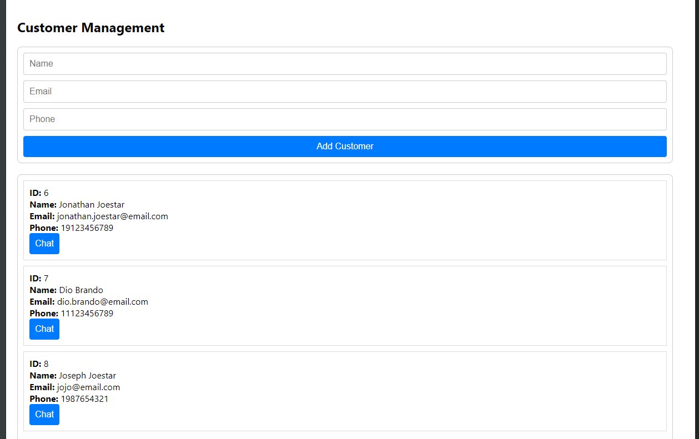
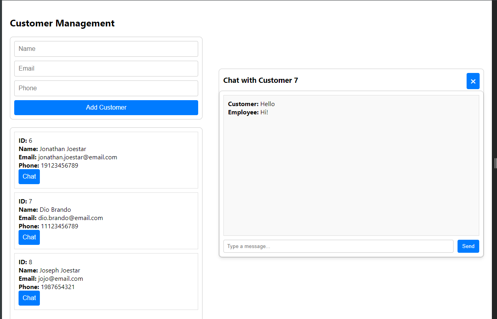
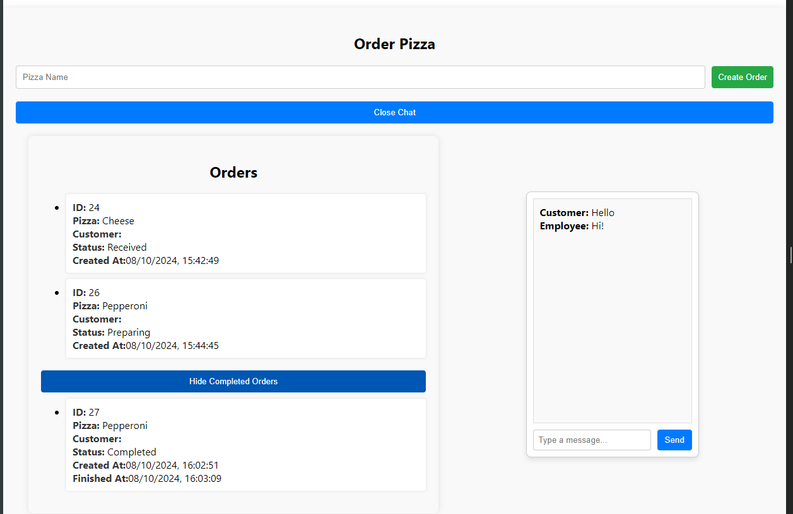

# Real-Time Pizza Ordering Dashboard

## Project Overview

This project is a **real-time pizza ordering dashboard** built using **.NET 8.0** for the back-end and **React** for the front-end. The primary goal of this project was to help me learn about **SignalR** and how to build real-time applications. The application allows employees to manage pizza orders and communicate with customers in real-time. Customers can place orders, track their progress, and chat with employees.

### Key Features:

-   **Real-Time Updates**: Orders and chat messages are updated in real-time using **SignalR**.
-   **Order Management**: Employees can view and manage pizza orders, advancing them through different stages (e.g., Received, Preparing, Baking, Ready for Pickup, Completed).
-   **Customer Chat**: Employees and customers can communicate via a real-time chat interface.
-   **Kanban Board**: Orders are displayed in a Kanban-style board, categorized by their current status.
-   **Pizza Order Statistics**: A bar chart shows the number of orders for each type of pizza, updated in real-time.

### Technologies Used:

-   **Back-End**: .NET 8.0, Entity Framework Core
-   **Front-End**: React, Chart.js
-   **Real-Time Communication**: SignalR for real-time updates and notifications
-   **Database**: SQLite for storing orders, customers, and chat messages
-   **Containerization**: Docker and Docker Compose for easy setup and deployment

---

## Running the Project with Docker Compose

To run the project using Docker Compose, follow these steps:

1. **Run Docker Compose**:
   In the root directory of the project, run the following command to start both the back-end and front-end services:

    ```bash
    docker-compose up --build
    ```

    This will:

    - Build and start the **.NET 8.0 back-end** service.
    - Build and start the **React front-end** service.
    - Set up the necessary networking between the services.

2. **Access the Application**:
   Once the services are up and running, you can access the application in your browser:

    - **Front-End**: `http://localhost:3000`
    - **Back-End API**: `http://localhost:5003`

---

## Front-End

The front-end of the application is built using **React** and communicates with the back-end via **SignalR** for real-time updates. The front-end provides a user-friendly interface for both employees and customers to interact with the system.

### Features:

-   **Order List**: Displays all current orders, categorized by their status (Received, Preparing, Baking, Ready for Pickup, Completed). Employees can advance orders through the stages.
-   **Pizza Order Statistics**: A horizontal bar chart shows the number of orders for each type of pizza. This chart updates in real-time as new orders are placed.
-   **Customer Chat**: Employees can chat with customers in real-time. The chat window is dynamically updated based on the selected customer.
-   **Customer Order Tracking**: Customers can track the status of their orders in real-time and communicate with employees via the chat interface.

### Screenshots:

#### Kanban Pizza Board



#### Piza Order Statistics



#### Customer Management



#### Customer Management Chat



#### Customer Order



---

## Back-End

The back-end of the application is built using **.NET 8.0** and provides a RESTful API for managing orders, customers, and chat messages. The back-end also uses **SignalR** to provide real-time updates to the front-end.

### Features:

-   **Order Management**: The back-end provides endpoints for creating, updating, and retrieving orders. Orders are stored in a **SQLite** database and can be advanced through different stages (Received, Preparing, Baking, Ready for Pickup, Completed).
-   **Customer Management**: The back-end provides endpoints for creating and retrieving customers. Each customer is associated with their orders and chat messages.
-   **Real-Time Chat**: The back-end uses **SignalR** to enable real-time chat between employees and customers. Messages are stored in the database and broadcast to the appropriate customer. **SignalR groups** are used to separate chat messages by customer. This ensures that messages are only sent to the appropriate customer and employee.

### API Endpoints:

A Swagger documentation is provided in `http://localhost:5003/swagger/index.html`

-   **Orders**:
    -   `GET /api/Orders`: Retrieves all orders.
    -   `POST /api/Orders`: Creates a new order.
    -   `PUT /api/Orders/{id}`: Updates an existing order.
    -   `PUT /api/Orders/advance/{id}`: Advances an order to the next status.
    -   `DELETE /api/Orders`: Deletes an existing order.
-   **Customers**:
    -   `GET /api/Customers`: Retrieves all customers.
    -   `POST /api/Customers`: Creates a new customer.
    -   `DELETE /api/Customers`: Deletes a customer.
-   **Chat**
    -   `GET /api/Chat/{customerId}`: Retrieves the customer's chat messages
-   **SignalR Hub**:
    -   `/dataHub`: Provides real-time communication for order updates.
    -   `/chatHub`: Provides real-time communication for chat updates.

## What I Learned About SignalR

### What is SignalR?

SignalR is a powerful library for **real-time web functionality** that allows server-side code to push updates to connected clients instantly, without the need for clients to repeatedly poll the server for changes. One of it's biggest advantages is its ability to abstract the complexities of real-time communication by automatically selecting the best transport method available (e.g., WebSockets, Server-Sent Events, or Long Polling). It can also automatically attempt to reconnect clients if the connection is lost, ensuring a seamless user experience.

### How SignalR Was Used in This Project:

1. **Real-Time Chat**:
    - SignalR was used to enable real-time communication between employees and customers. The front-end application sends the messages through a hub to the back-end, which in turn, sends the message to the correct recipient. The real-time functionality of the application is what allows a fluent conversation between the two parties.
2. **Real-Time Order Updates**:
    - SignalR was also used to update the order list and pizza statistics in real-time. Whenever an order is created or updated, the back-end broadcasts the changes to all connected clients, making it simple and easy to follow updates on each order.

### SignalR Groups:

SignalR groups are a way to organize connections into logical groups. A connection can belong to multiple groups, and messages sent to a group are only received by the connections in that group. This powerful functionality was used to organize and separate chat messages by customer. Each customer has their own group, and employees join and leave groups dynamically based on the customer they are chatting with. This ensures that messages are only sent to the appropriate customer and employee, preventing cross-chat interference. It also allows a single connection to be created for all chat messages.

For example:

-   When an employee opens the chat for Customer 1, they join the group for Customer 1.
-   When they switch to Customer 2, they leave the group for Customer 1 and join the group for Customer 2.

### Key Takeaways:

-   SignalR is a powerful tool for building real-time applications, and its abstraction of transport methods makes it easy to use.
-   Groups are an essential feature for managing real-time communication in multi-user scenarios, as they allow you to logically separate messages and updates.
-   SignalR's integration with .NET and its support for automatic reconnection make it a great choice for building robust real-time systems.
